# AWS RDS MySQL Setup Project

## Project Overview

This project demonstrates the deployment and configuration of an Amazon RDS MySQL database instance on AWS. The objective was to create a secure and scalable managed database environment, configure networking and security settings, and establish connectivity from an Amazon EC2 instance.

---

## Business Scenario

A startup plans to migrate its on-premises MySQL database to AWS to improve scalability, availability, and operational efficiency. As a Cloud Engineer, the responsibility was to provision an Amazon RDS MySQL instance, configure networking and security settings, and validate database connectivity from a compute instance within AWS.

---

## AWS Services Used

* Amazon RDS
* Amazon EC2
* Security Groups
* MySQL Community Edition
* MariaDB Client

---

## Configuration Details

| Parameter         | Value                     |
| ----------------- | ------------------------- |
| Database Engine   | MySQL Community Edition   |
| DB Instance Class | db.t3.micro               |
| Storage Type      | General Purpose SSD (gp3) |
| Allocated Storage | 20 GB                     |
| Availability      | Single-AZ                 |
| Public Access     | Enabled                   |
| Database Port     | 3306                      |

---

## Step 1: Configure RDS MySQL Instance

Selected the MySQL database engine, enabled the Free Tier deployment option, and configured the initial database settings.

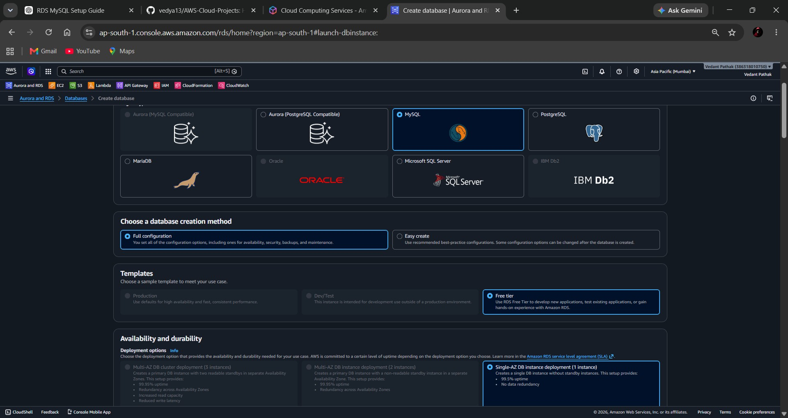

Configured additional database settings including deployment options and availability settings.

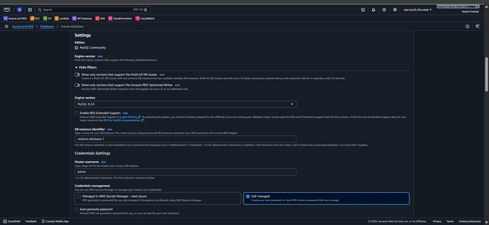

Configured instance specifications and storage allocation.

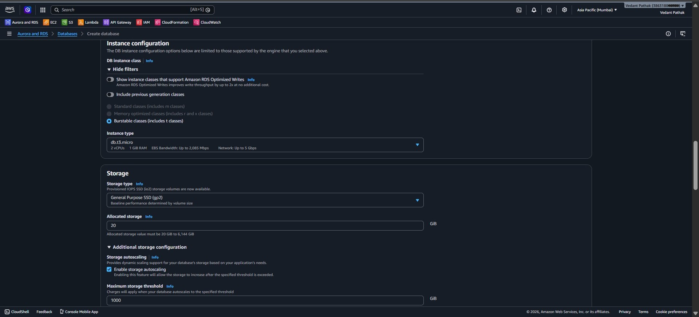

Configured networking, VPC selection, and public accessibility options.

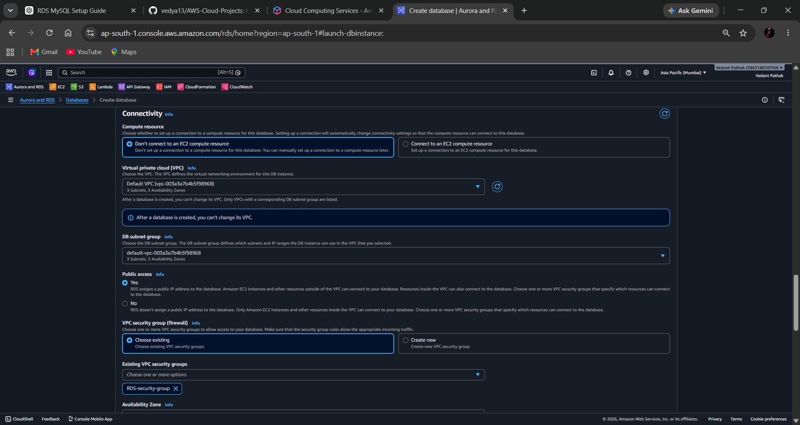

---

## Step 2: Verify RDS Availability and Retrieve Endpoint

After deployment, verified that the RDS instance was successfully created and available for connections.

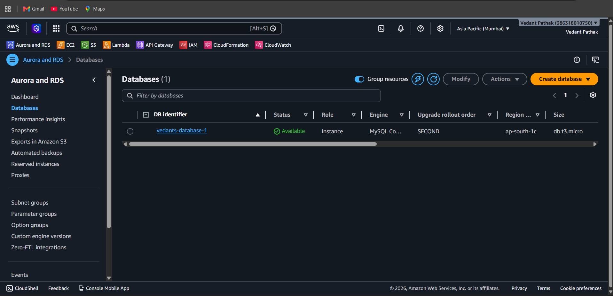

Retrieved the database endpoint and reviewed connectivity and security configurations.

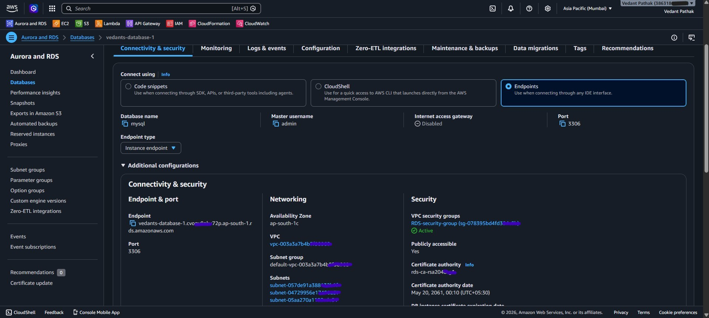

---

## Step 3: Review RDS Configuration

Validated the final database configuration, networking setup, storage allocation, and security settings.

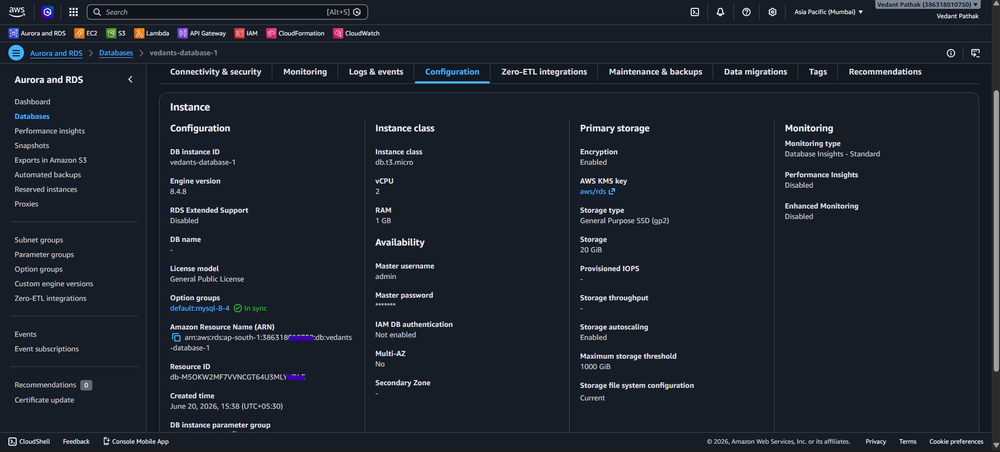

---

## Step 4: Launch and Configure Amazon EC2 Instance

Created a new Amazon EC2 instance to serve as a client machine for database connectivity testing.

Launched the EC2 instance.

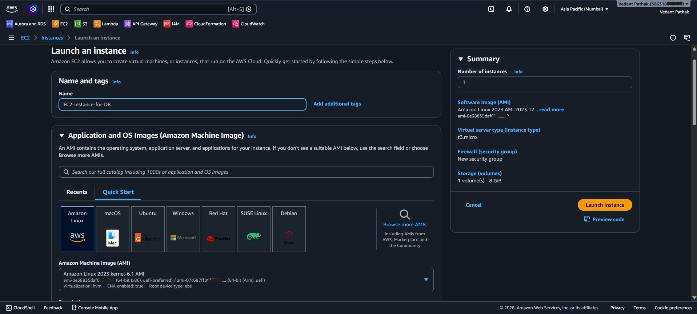

Selected the instance type and configured compute resources.

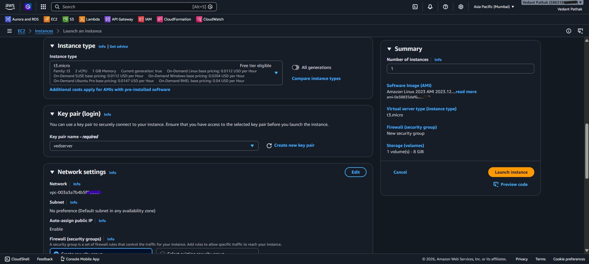

Configured networking, storage, and security settings.

Verified successful instance deployment.

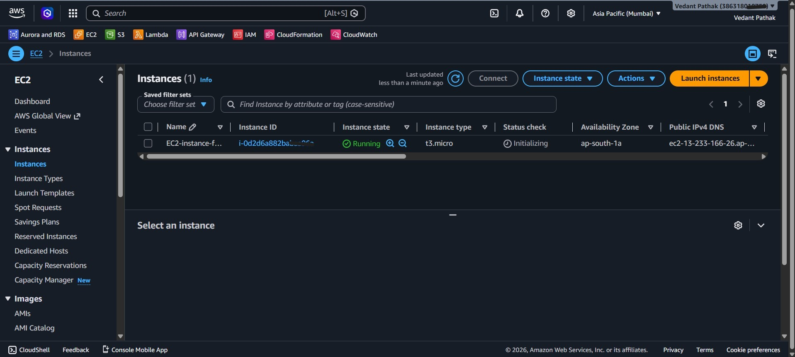

Connected to the EC2 instance using SSH.

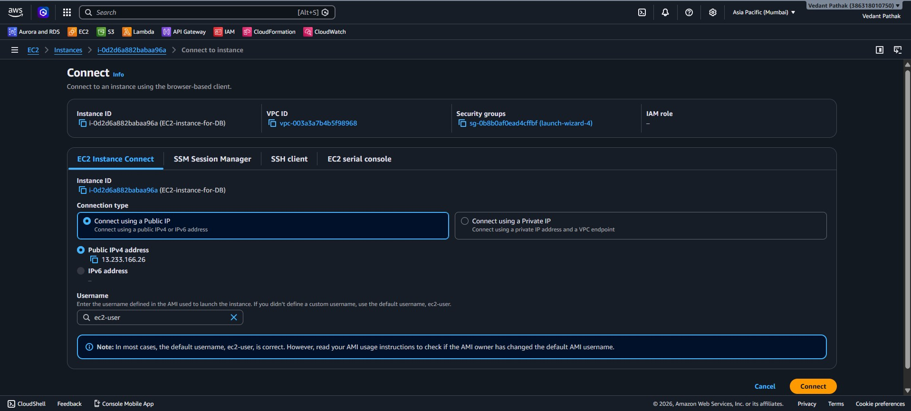

---

## Step 5: Install MariaDB Client and Connect to RDS

Installed the MariaDB client package on the EC2 instance to establish connectivity with the Amazon RDS MySQL database.

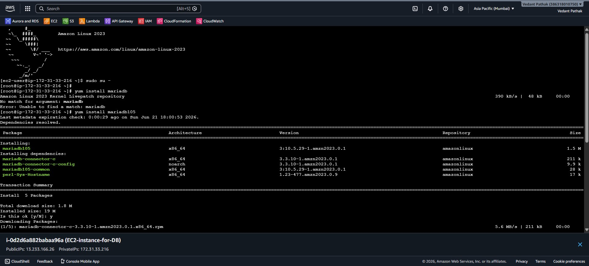

Connected to the RDS instance and created a test database to validate successful communication between EC2 and RDS.

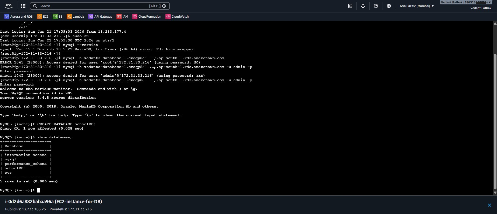

---

## Validation Performed

* Successfully provisioned an Amazon RDS MySQL instance.
* Configured storage, networking, and security settings.
* Retrieved and validated the RDS endpoint.
* Launched an Amazon EC2 instance.
* Installed MariaDB client tools.
* Connected EC2 to RDS using the database endpoint.
* Created and verified a test database.
* Confirmed successful end-to-end connectivity.

---

## Key Learning Outcomes

* Amazon RDS deployment and management.
* AWS networking and VPC configuration.
* Security Group configuration for database access.
* EC2-to-RDS connectivity.
* MySQL database administration fundamentals.
* Cloud infrastructure deployment using AWS services.

---

## Project Outcome

Successfully deployed and configured an Amazon RDS MySQL database environment on AWS. Established secure connectivity between an EC2 instance and the RDS database, validated database access, and performed database creation operations. This project demonstrates practical experience with AWS database services, networking, and cloud infrastructure management.
