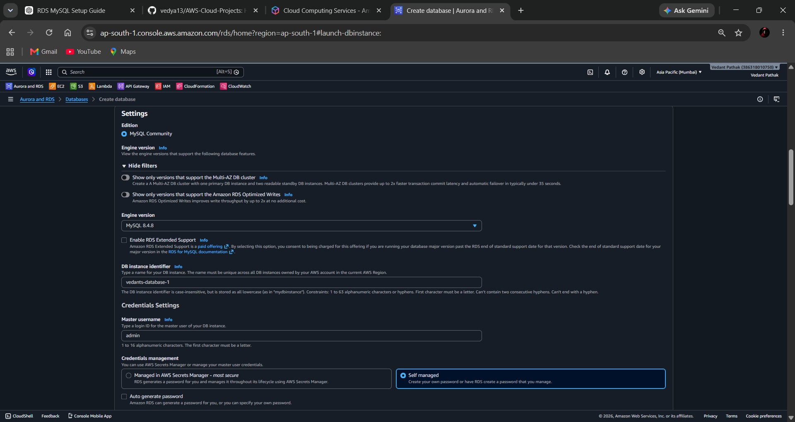
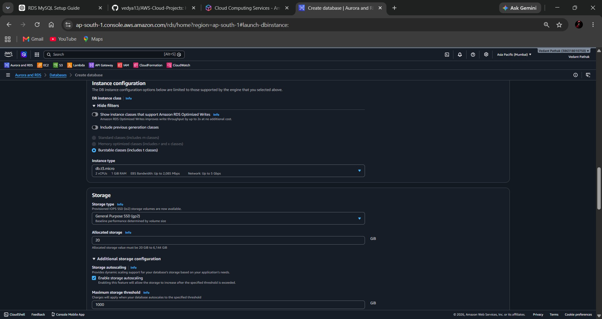

# AWS RDS MySQL Setup

## Project Overview

This project demonstrates the deployment and configuration of an Amazon RDS MySQL database instance on AWS. The objective was to create a development database environment, configure networking and security settings, and establish database connectivity.

---

## Scenario

A startup wants to migrate its local MySQL database to AWS. As a cloud engineer, the task was to create an Amazon RDS MySQL instance, configure networking and security settings, and establish database connectivity.

---

## Services Used

- Amazon RDS
- MySQL Community Edition
- Amazon VPC
- Security Groups
- Amazon EC2
- MySQL Client

---

## Configuration Details

| Parameter | Value |
|------------|--------|
| Database Engine | MySQL Community |
| DB Instance Class | db.t3.micro |
| Storage Type | General Purpose SSD (gp3) |
| Allocated Storage | 20 GB |
| Availability | Single DB Instance |
| Public Access | Enabled |
| Database Port | 3306 |

---

## Step 1: Select MySQL Engine and Database Configuration

Configured the MySQL engine, selected Full Configuration mode, and chose the Free Tier template for the RDS instance.

---

## Step 2: Configure Credentials

Configured the database identifier and administrator credentials required for database access.

---

## Step 3: Configure Instance and Storage

Selected the db.t3.micro instance type and allocated 20 GB General Purpose SSD (gp3) storage.

---

## Step 4: Configure Connectivity

Enabled public access, selected the appropriate VPC, and configured networking settings for the RDS instance.

---

## Project Status

- [x] RDS Instance Configuration Completed
- [ ] Database Availability Verification
- [ ] Security Group Configuration
- [ ] Endpoint Retrieval
- [ ] EC2 Connectivity Testing
- [ ] Database Creation (dev_db)
- [ ] Database Verification

---

## Next Steps

The following tasks will be completed in the next phase of the project:

1. Verify RDS instance availability.
2. Configure inbound security group rules for MySQL (Port 3306).
3. Retrieve the RDS endpoint.
4. Launch and connect an EC2 instance.
5. Connect to the RDS instance using MySQL client.
6. Create a database schema named `dev_db`.
7. Verify successful database creation.

---

## Outcome

Successfully configured an Amazon RDS MySQL instance for development and testing purposes using AWS RDS. Additional configuration and connectivity testing will be performed to complete the deployment.
