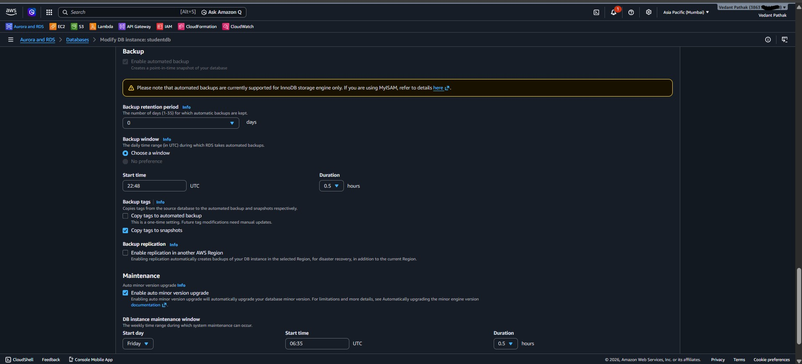
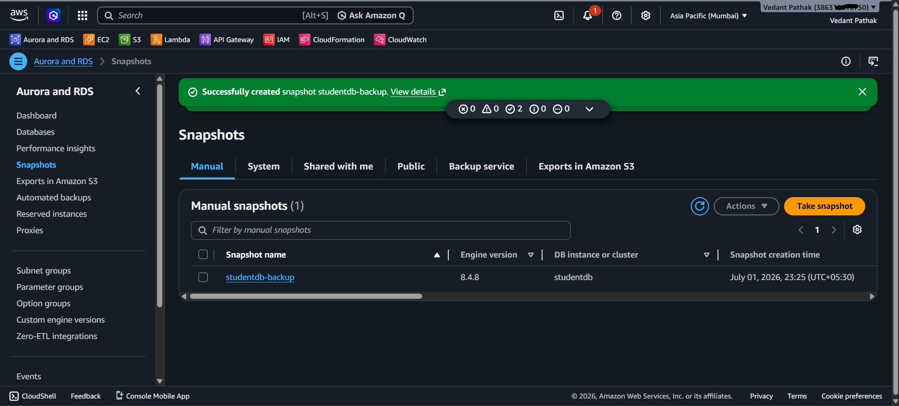
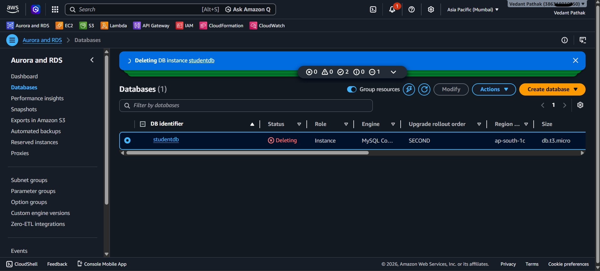
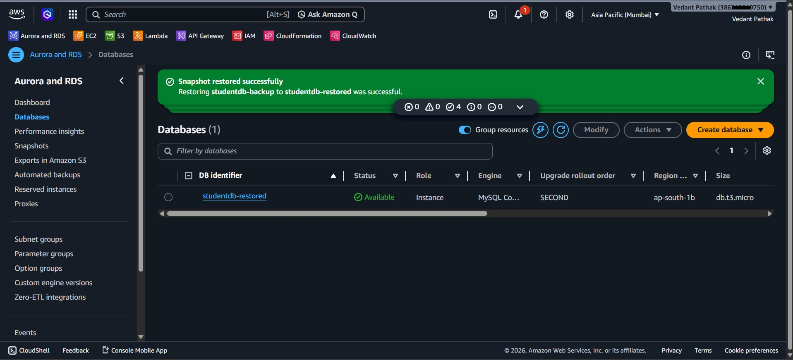
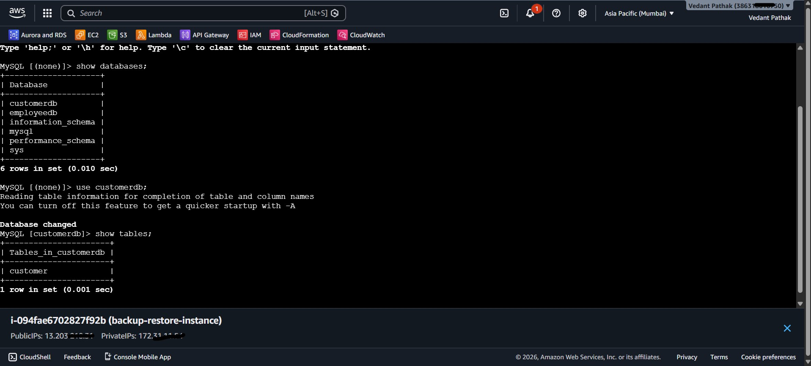
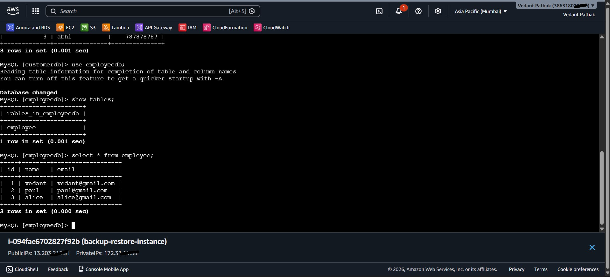

# AWS RDS Backup and Restore

## Project Overview

This project demonstrates how to perform backup and disaster recovery operations using Amazon RDS for MySQL. 
The objective is to understand automated backups, manual snapshots, database restoration, and data verification after recovery.

## Objective

- Enable automated backups for an RDS instance.
- Create a manual snapshot of the database.
- Simulate accidental database deletion.
- Restore the database from a manual snapshot.
- Verify data integrity after restoration.

## AWS Services Used

- Amazon RDS (MySQL)
- Amazon EC2 (MySQL Client)
- Amazon VPC
- Security Groups

## Prerequisites

- AWS Account
- Existing Amazon RDS MySQL instance
- Amazon EC2 instance with MySQL client installed
- Database containing sample data

## Project Architecture

```
EC2 Instance
      │
      │ MySQL Connection
      ▼
Amazon RDS (MySQL)
      │
      ▼
Manual Snapshot
      │
      ▼
Delete Original Database
      │
      ▼
Restore New RDS Instance
      │
      ▼
Verify Restored Data

```

## Implementation Steps

### Step 1: Configure Automated Backup

- Open the existing RDS instance.
- Navigate to **Modify**.
- Configure the backup retention period.
- Apply the changes.

---

### Step 2: Create a Manual Snapshot

- Select the RDS instance.
- Click **Actions → Take Snapshot**.
- Provide a snapshot name.
- Wait until the snapshot status becomes **Available**.

---

### Step 3: Delete the Original Database

- Select the RDS instance.
- Click **Delete**.
- Skip creating a final snapshot (manual snapshot already exists).
- Confirm deletion.

---

### Step 4: Restore Database

- Open the Snapshots section.
- Select the manual snapshot.
- Click **Restore Snapshot**.
- Provide a new DB instance identifier.
- Wait until the restored database status becomes **Available**.

---

### Step 5: Verify Restored Data

Connect to the restored database using the MySQL client.

```sql
SHOW DATABASES;

USE employeedb;

SHOW TABLES;

SELECT * FROM employee;
```

Verify that all tables and records are successfully restored.

## Screenshots

### Backup Configuration



### Manual Snapshot





### Restored Database



### Data Verification





## Learning Outcomes

- Learned the difference between automated backups and manual snapshots.
- Understood how Amazon RDS snapshots are used for disaster recovery.
- Successfully restored a deleted database from a manual snapshot.
- Verified data integrity after restoration.
- Gained hands-on experience with backup and recovery operations in AWS.

## Repository Structure

```
AWS-RDS-Backup-and-Restore/
│
├── README.md
└── screenshots/
    ├── backup-settings.png
    ├── manual-snapshot.png
    ├── restored-db.png
    └── query-output.png
```

## Conclusion

This project demonstrates a complete backup and recovery workflow using Amazon RDS. It highlights the importance of snapshots and restoration for protecting production databases against accidental deletion and data loss.
